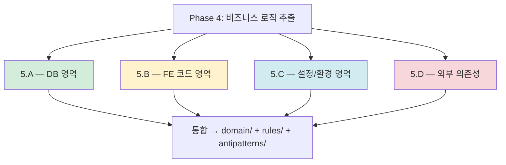

# Phase 4: 비즈니스 로직 추출 (4영역 병렬)

> 본 문서는 Phase 4 (`/analyze-business-logic`)의 명세다.
> v1.1 핵심 변경: "Cross-Cutting" 폐기, **4개 영역 병렬 추출**로 대체.
> 관련: plan.md §5, ADR-004 (DDD-Lite B)

---

## 1. 목적

비즈니스 로직을 **4개 영역에서 병렬로 추출**하여 도메인 모델(#2), 비즈니스 규칙(#5), 안티패턴(#6)의 **핵심 내용**을 생성한다.

이 단계가 답하는 질문:
- 어떤 도메인 엔티티와 유스케이스가 있는가?
- 어떤 비즈니스 규칙/정책이 코드에 있는가?
- 어디에 안티패턴이 있는가?

---

## 2. 입력

| 입력 | 출처 | 필수/선택 |
|---|---|---|
| Phase 1 inventory | `.ai-analysis/output/inventory/` | 필수 |
| Phase 2 DB 스키마 | `.ai-analysis/output/db/` | 필수 |
| Phase 3 아키텍처 | `.ai-analysis/output/architecture/` | 필수 |
| 소스 코드 | 원본 레포 | 필수 |
| domain-context.md | `.ai-analysis/inputs/` | 선택 (LLM grounding) |

---

## 3. 4개 영역 — 병렬 추출



### 3.1 영역 5.A — DB 영역

**추출 대상**:
- ORM 엔티티 메서드의 비즈니스 로직 (`Order.cancel()` 등)
- ORM 어노테이션 제약 (`@Column(nullable=false)`)
- MyBatis XML 쿼리의 CASE/WHERE 정책
- JPA @Query, JPQL, Native Query
- Stored Procedure 본문
- DB CHECK/UNIQUE/Trigger

**도구**: Tree-sitter, MyBatis 파서, JPA 어노테이션 추출, 운영 DB 메타데이터

**산출 매핑**:
- ORM 메서드 → 도메인 모델 (#2)
- SQL CASE/WHERE → 비즈니스 규칙 (#5)
- N+1, SQL에 정책 박힘 → 안티패턴 (#6)

### 3.2 영역 5.B — FE 코드 영역

**추출 대상**:
- 폼 validation (yup, zod, react-hook-form)
- 권한별 UI 분기 (`role === 'ADMIN'`)
- 라우팅 가드 (인증/권한 체크)
- BFF 응답 변환 로직
- 클라이언트 캐시 정책 (SWR, TanStack Query)

**산출 매핑**:
- validation 스키마 → 비즈니스 규칙 (#5)
- 권한 분기 → 비즈니스 규칙 (#5)
- FE-BE 검증 중복/누락 → 안티패턴 (#6)

### 3.3 영역 5.C — 설정/환경 정책

**추출 대상**:
- application.yml/properties의 매직 넘버
- 환경별 정책 차이 (dev/staging/prod)
- Feature Flag 시스템
- 환경 변수의 비즈니스 의미

**산출 매핑**:
- 매직 넘버 → 비즈니스 규칙 (#5)
- 환경별 정책 차이 → 안티패턴 (#6) (정책 분산 경고)

### 3.4 영역 5.D — 외부 의존성 매핑

**추출 대상**:
- HTTP 클라이언트 호출 지점
- Webhook 수신 엔드포인트
- 메시지 브로커 발행/구독 (Kafka, RabbitMQ)
- SSO/OAuth 통합 지점
- 결제/SMS/이메일 외부 서비스

**산출 매핑**:
- 외부 인터페이스 명세 → API 계약 (#3) 보강
- 통합 지점 위치 → 아키텍처 (#1)
- 외부 의존성 위험 (단일 장애점 등) → 안티패턴 (#6)

---

## 4. 출력

### 4.1 파일 구성

```
.ai-analysis/output/domain/           # 도메인 모델 (#2)
├── domain.json
├── domain.md
├── domain.mermaid
├── use-cases.md
└── ubiquitous-language.md

.ai-analysis/output/rules/            # 비즈니스 규칙 (#5) — 부분
├── rules.json
├── rules.md
└── state-diagrams/

.ai-analysis/output/antipatterns/      # 안티패턴 (#6) — 부분
├── antipatterns-partial.json          # Phase 6에서 전체 통합
```

---

## 5. 승인 게이트 기준

```
□ domain.json schema 검증 통과
□ rules.json schema 검증 통과
□ 4개 영역 모두 추출 시도 완료 (FE 없으면 5.B 스킵 OK)
□ 도메인 모델 classDiagram 렌더링
□ Use Case ↔ Entity 매핑 일관성
□ 비즈니스 규칙 Given/When/Then 형식 준수
□ human_review_required 항목 사용자 검토
□ 안티패턴 부분 목록 확인
```

승인 후 Phase 5 진입.

---

## 6. 신뢰도

| 영역 | 평균 신뢰도 | 비고 |
|---|---|---|
| 5.A DB | 0.75 | ORM 있으면 ↑, 없으면 ↓ |
| 5.B FE | 0.75 | validation 스키마 있으면 ↑ |
| 5.C 설정 | 0.80 | 설정 파일 직접 추출 |
| 5.D 외부 | 0.50 | LLM 추론 비중↑ |

**Phase 4 전체**: ~70% (7대 산출물 중 가장 LLM 의존도 높음)

---

## 7. 흔한 함정

### 7.1 Anemic Domain Model 무시
- 증상: Service에 모든 로직, Entity는 DTO 수준
- 대응: AP-DOMAIN-ANEMIC 등록 + 도메인 로직 위치 기록

### 7.2 FE 영역 건너뛰기
- 증상: BE만 분석하고 FE validation 무시
- 결과: FE-BE 검증 불일치 미발견
- 대응: FE 소스 있으면 5.B 필수 진행

### 7.3 매직 넘버의 의도 과신
- 증상: `MAX_RETRY=3`의 이유를 LLM이 추론
- 결과: 실제 이유와 다를 수 있음
- 대응: 모든 매직 넘버 BR에 human_review_required=true

### 7.4 외부 의존성 누락
- 증상: REST 호출만 추적하고 SDK/gRPC 누락
- 대응: 패키지 매니페스트에서 외부 SDK 의존성도 수거

---

## 8. 다음 단계

Phase 5-1 (`/analyze-api`) + Phase 5-2 (`/analyze-ui`) 병렬 진입.
