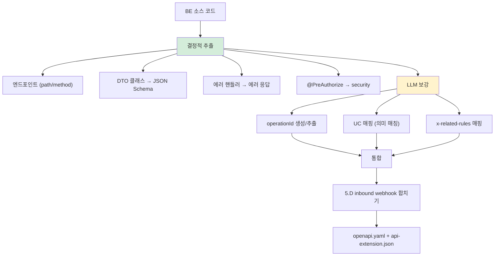

# Phase 5-1: api (API 계약 추출)

> 본 문서는 Phase 5-1 (`/analyze-api`)의 명세다.
> Phase 5-2 (UI)와 **병렬 실행 가능**.

---

## 1. 목적

Controller/Router에서 **OpenAPI 3.1 명세를 추출**하고, 산출물 간 ID 매핑 (operationId ↔ UC, x-related-rules)을 완성한다.

---

## 2. 입력

| 입력 | 비고 |
|---|---|
| 소스 코드 (BE) | Controller, Router 어노테이션 |
| Phase 1 inventory | BE 프레임워크 정보 |
| Phase 4 결과 | 도메인 모델 (UC), 비즈니스 규칙 (BR), 외부 의존성 (5.D inbound webhook) |
| Phase 2 schema | DTO ↔ DB 컬럼 정합성 (있으면) |

---

## 3. 처리



### 3.1 프레임워크별 추출

| 프레임워크 | 단서 |
|---|---|
| Spring | `@RestController`, `@GetMapping` 등 |
| NestJS | `@Controller`, `@Get`, `@Post` |
| Express | router.get/post/put/delete 호출 |
| FastAPI | `@app.get`, `@router.get` |

### 3.2 OpenAPI 표준 유지 + 확장

표준 OpenAPI 3.1 그대로 + `x-` prefix 확장만 추가:

```yaml
paths:
  /orders:
    post:
      operationId: createOrder
      x-related-use-cases: [UC-ORDER-001]
      x-related-rules: [BR-ORDER-007, BR-ORDER-008]
      x-confidence: 0.85
```

---

## 4. 출력

```
.ai-analysis/output/api/
├── openapi.yaml             # 표준 (외부 공유 가능)
├── api-extension.json       # AI 분석 메타
├── api.md                   # 사람용 요약
└── (선택) swagger-ui-build/
```

---

## 5. 승인 게이트

```
□ openapi.yaml 표준 lint 통과 (spectral 등)
□ 모든 operationId가 unique
□ DTO 스키마 = JSON Schema 호환
□ 에러 응답 표준화 (4xx/5xx)
□ x-related-use-cases 매핑 = 사용자 검토
□ x-related-rules 매핑 = 사용자 검토
□ 5.D inbound webhook 합쳐짐
□ Swagger UI 렌더링 검증
```

---

## 6. 신뢰도

| 영역 | 신뢰도 |
|---|---|
| 엔드포인트 식별 | 0.95 |
| 요청/응답 스키마 | 0.85 |
| 에러 코드 | 0.70 |
| 인증/권한 | 0.75 |
| operationId ↔ UC 매핑 | 0.65 (사람 검토 권장) |
| x-related-rules | 0.60 (LLM 매칭) |

---

## 7. 흔한 함정

### 7.1 Swagger annotation 부재
- 증상: `@Operation` 등이 없어 추출 어려움
- 대응: 메서드명/파라미터로 LLM 추론 + 신뢰도↓

### 7.2 description에 비즈니스 정책
- 증상: API description에 정책 글로 박힘
- 대응: 정책은 BR로 분리 + x-related-rules로만 참조

### 7.3 동적 라우팅
- 증상: 런타임에 라우트 등록 (예: 플러그인 시스템)
- 결과: 정적 분석 못 함
- 대응: LLM 추론 + 신뢰도 표기

### 7.4 GraphQL/gRPC 혼재
- 증상: REST API + GraphQL 함께 사용
- 대응: v1.1은 REST 우선. GraphQL은 별도 산출물로 추가 (v1.2)

---

## 8. 다음

Phase 6 (`/analyze-quality`) 진입 (Phase 5-2와 합쳐서).
