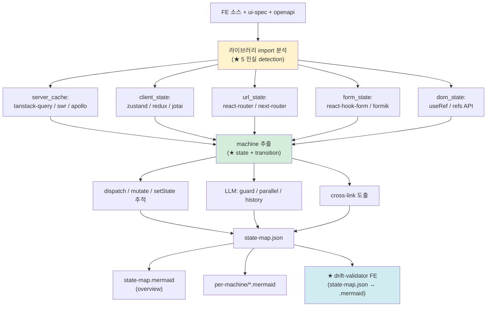

# Phase 5-2-b: state (분산 상태 명세 추출)

> 본 문서는 Phase 5-2-b (`/analyze-state`) 의 명세다. ★ v1.4 Stage 3-1 신설.
> 짝: `phase-5-2-a-ui-base.md` (UI 기본) / `phase-5-2-c-visual.md` (시각)
> deliverable: `8-state-map.md` (관련 schema: `state-map.schema.json`)
> ADR: ADR-FE-002 (이중 렌더링 FE 적용) + ADR-FE-005 (W3C SCXML 1.0 + XState 호환)

---

## 1. 목적

FE 코드에서 **분산 상태 5 진실** (server cache / client state / URL state / form state / DOM state) 추출 + state machine 형식 명세 산출.

사용자 요구 4 ("비즈니스 로직 동일") 정면 해소.

⚠️ **deliverable 7 (ui-spec) 와 다름**: 본 phase = 동적 행동 (state + transition + guard) / 정적 구조는 5-2-a.

---

## 2. 입력

| 입력 | 비고 |
|---|---|
| FE 소스 코드 | Tier 1~4 |
| Phase 5-2-a 결과 | ui-spec.json (페이지 / 컴포넌트 cross-link) |
| Phase 5-1 결과 | openapi.yaml (operationId cross-link) |
| Phase 4 결과 | rules.json (BR validates cross-link) |
| `package.json` | 라이브러리 import 그래프 (5 진실 detection) |

---

## 3. 처리



### 3.1 5 진실 detection (★ 핵심)

`state-map.schema.json` `state_sources[]` minItems=5/maxItems=5 강제. 모든 5 진실의 detected 여부 명시 의무.

```yaml
state_sources:
  - {source_type: server_cache, detected: true, library: tanstack-query, library_version: "5.59.0"}
  - {source_type: client_state, detected: true, library: zustand, library_version: "5.0.0"}
  - {source_type: url_state,    detected: true, library: react-router, library_version: "7.0.0"}
  - {source_type: form_state,   detected: true, library: react-hook-form, library_version: "7.53.0"}
  - {source_type: dom_state,    detected: false}  # 라이브러리 없으면 useRef 직접
```

### 3.2 machine 추출

| 추출 단계 | 출처 | 결정적/LLM |
|---|---|---|
| state set | useReducer 의 reducer / Zustand store / Redux slice / XState machine | 결정적 + LLM |
| transition | dispatch / setState / mutate 호출 추적 | 결정적 + LLM |
| guard | if 조건 / 검증 함수 | LLM 추론 |
| parallel region | 동시 active region (예: modal + page) | LLM 추론 |
| history | route restore / modal 복원 | LLM 추론 |

### 3.3 SCXML / XState 호환 표기

각 machine 에 `scxml_compliant` + `xstate_compatible` 플래그 의무. true 시 Stage 5+ 진짜 변환 검증 가능.

### 3.4 cross-link (★ Phase 4.5 패턴)

```yaml
cross_links:
  - {from_machine: FSM-FE-LOGIN-001, to_artifact: api,     to_id: postLogin,     link_type: triggers}
  - {from_machine: FSM-FE-LOGIN-001, to_artifact: ui-spec, to_id: PAGE-LOGIN-001, link_type: implements}
  - {from_machine: FSM-FE-LOGIN-001, to_artifact: rules,   to_id: BR-AUTH-001,    link_type: validates}
```

---

## 4. 출력

```
.ai-analysis/output/state-map/
├── state-map.json              # AI 눈 (SCXML 1.0 + XState 호환)
├── state-map.mermaid           # 사람 눈 (overview)
├── per-machine/
│   ├── FSM-FE-LOGIN-001.mermaid
│   └── ...
└── _manifest.yml               # trust_level + validation_history
```

---

## 5. 승인 게이트

```
□ state-map.json schema 검증 (state-map.schema.json) 통과
□ state_sources 5 항목 (server/client/URL/form/DOM) 모두 명시
□ 모든 machine 에 ID, scope, initial, states 명시
□ rendered_mermaid_path 경로 존재 (이중 렌더링 정합)
□ ★ drift-validator FE 통과 (state-map.json ↔ .mermaid 의미 동일성)
□ cross_links 의무 (api / ui-spec / rules 중 1개 이상)
□ scxml_compliant=true 머신 → SCXML XML 변환 가능 (★ Stage 5+ 검증)
□ trust_step 명시 (1~8)
□ primary_source_type=mixed 머신 → finding 등록 (분산 위험)
```

---

## 6. 신뢰도 (★ ADR-009 §2.4.1 state-map 행 정합)

| 단계 | 조건 | 신뢰도 |
|---|---|---|
| 1 | 1차 작성 | 60-70% |
| 2 | + cross-validation | 75-85% |
| 3 | + drift-validator FE 통과 | 78-85% |
| 5 | + ★ XState v5+ SCXML import 검증 | 85-92% |

---

## 7. 흔한 함정

deliverable 8 §12 정합:
- race condition (server cache ↔ client state)
- stale cache (refetch 누락)
- split brain (URL state ↔ form state)
- over-globalization (Redux 에 모든 데이터)
- controlled input 으로 DOM 진실 무시

→ 각 함정 = AP-FE-STATE-XXX 안티패턴 등록 (Phase 6).

---

## 8. 다음

- Phase 5-2-c (visual) 진입 (deliverable 9 산출)
- Phase 6 (`/analyze-quality`) AP-FE-STATE-* 등록
