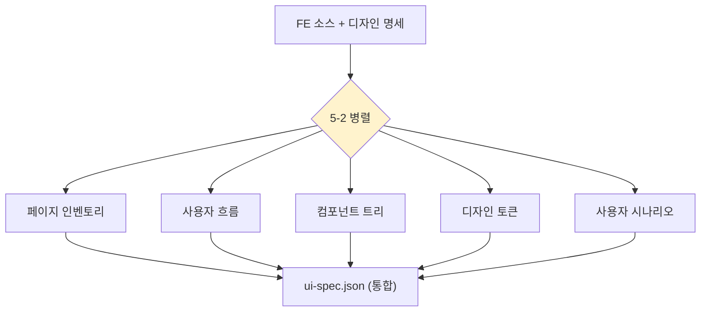
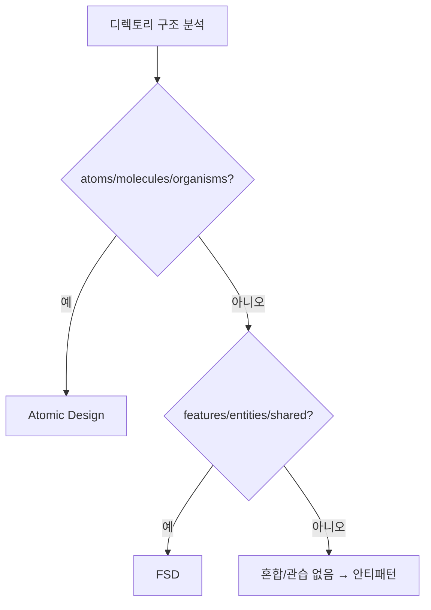

# Phase 5-2: ui (UI/UX 명세 추출)

> 본 문서는 Phase 5-2 (`/analyze-ui`)의 명세다.
> Phase 5-1 (API)와 **병렬 실행 가능**.

---

## 1. 목적

FE 코드에서 **5개 하위 산출물**을 추출:
1. 페이지 인벤토리
2. 사용자 흐름
3. 컴포넌트 트리 (Atomic Design 또는 FSD)
4. 디자인 토큰
5. 사용자 시나리오

⚠️ **Phase 4 5.B(FE 비즈니스 로직)와 다름**: 같은 FE 코드를 **다른 시각**으로. 5.B는 비즈니스 로직, 5-2는 UI 구조.

---

## 2. 입력

| 입력 | 비고 |
|---|---|
| FE 소스 코드 | React/Vue/Angular |
| 디자인 명세 | `inputs/design/` (있으면) |
| Storybook 설정 | 컴포넌트 분류 보강 |
| Phase 4 결과 | UC, BR (시나리오 매핑용) |
| Phase 5-1 결과 | API 호출 매핑 |

---

## 3. 처리 — 5개 하위 산출물 병렬



### 3.1 페이지 인벤토리

라우팅 설정 자동 추출:
- React Router: `<Route>` 컴포넌트
- Next.js: `pages/` 또는 `app/` 디렉토리 구조
- Vue Router: routes 배열

→ pages.json (PAGE-XXX ID 부여)

### 3.2 사용자 흐름

`navigate()`, `<Link>`, `<a href>` 호출 추적 + 조건부 분기 LLM 추론:

```typescript
const handleSubmit = async () => {
    if (!user) {
        navigate('/login');  // 분기 1
        return;
    }
    if (cart.length === 0) {
        toast('장바구니 비어있음');  // 분기 2 (네비게이션 X)
        return;
    }
    navigate('/checkout');  // 분기 3
};
```

→ Mermaid flowchart 자동 생성.

### 3.3 컴포넌트 트리

Atomic Design vs FSD 자동 감지 (7-ui-ux.md §6 참조):



### 3.4 디자인 토큰

| 출처 | 추출 가능성 |
|---|---|
| Tailwind config | 매우 높음 (95%) |
| CSS variables | 높음 (90%) |
| Styled-components theme | 높음 (85%) |
| Material-UI theme | 높음 (90%) |
| 인라인 스타일 난무 | 매우 낮음 (30%) → 안티패턴 |

W3C Design Tokens Community Group 표준 형식으로 변환.

### 3.5 사용자 시나리오 (가장 어려움)

LLM이 다음을 종합:
- 페이지 흐름 (3.2)
- 페이지의 API 호출 (Phase 5-1 매핑)
- 페이지의 권한 요구 (Phase 4 5.B)
- 도메인 UC (Phase 4)

→ end-to-end 시나리오 (SCN-XXX)

⚠️ 신뢰도 가장 낮음 (0.6). 기획자 검토 강제.

---

## 4. 출력

```
.ai-analysis/output/ui/
├── ui-spec.json             # 통합
├── pages.md                 # 페이지 인벤토리 사람용
├── user-flows.mermaid       # 사용자 흐름 다이어그램
├── components.md            # 컴포넌트 트리
├── design-tokens.json       # 디자인 토큰
└── scenarios.md             # 사용자 시나리오
```

---

## 5. 승인 게이트

```
□ ui-spec.json schema 검증 통과
□ 모든 PAGE에 ID, route, auth, roles
□ 사용자 흐름 Mermaid 렌더링
□ 컴포넌트 분류 방식 (Atomic / FSD) 명시
□ 디자인 토큰 명세 (없으면 안티패턴 등록)
□ 사용자 시나리오 = 기획자 검토 완료
□ 페이지 ↔ API 매핑 = Phase 5-1과 정합
□ 페이지 ↔ UC 매핑 = Phase 4와 정합
```

---

## 6. 신뢰도

| 영역 | 신뢰도 |
|---|---|
| 페이지 인벤토리 | 0.95 |
| 컴포넌트 트리 | 0.90 |
| 사용자 흐름 (단순) | 0.85 |
| 사용자 흐름 (조건부 분기) | 0.65 |
| 디자인 토큰 (좋은 케이스) | 0.90 |
| 디자인 토큰 (나쁜 케이스) | 0.30 |
| 사용자 시나리오 | 0.60 |

---

## 7. 흔한 함정

### 7.1 디자인 시스템 부재
- 증상: 인라인 스타일/매직 색상값 난무
- 대응: design-tokens.json 신뢰도↓ + AP-FE 등록

### 7.2 컴포넌트 분류 부재
- 증상: 모든 컴포넌트가 src/components/ 평면 배치
- 대응: LLM 추론으로 후보 분류 + AP 등록

### 7.3 시나리오 vs UC 혼동
- 증상: SCN과 UC를 같은 것으로 다룸
- 대응: SCN = 사용자 경험, UC = 시스템 행동 (구분)

### 7.4 라우팅 설정 분산
- 증상: 라우트가 여러 파일에 흩어짐
- 대응: 통합 추출 + AP 등록

### 7.5 SSR/CSR 혼재
- 증상: Next.js의 server/client 컴포넌트 구분 무시
- 대응: 명시적 표기 (server: true/false)

---

## 8. 다음

Phase 6 (`/analyze-quality`) 진입.
