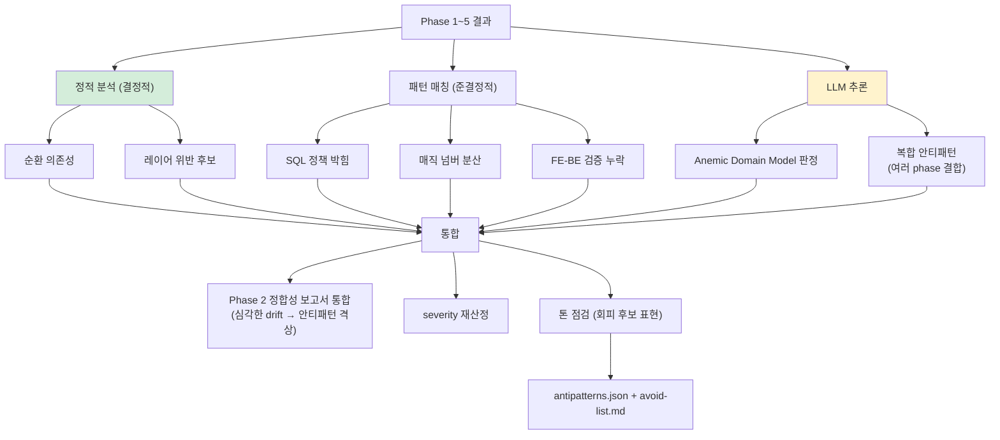
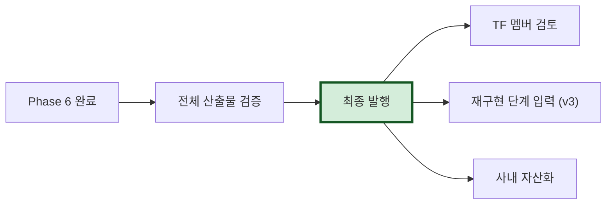

# Phase 6: quality (안티패턴 통합)

> 본 문서는 Phase 6 (`/analyze-quality`)의 명세다.
> 워크플로우의 **마지막 단계** — Phase 1~5 결과를 통합하여 안티패턴 카탈로그 완성.

---

## 1. 목적

Phase 1~5 모두의 결과를 **통합 분석**하여 최종 안티패턴 카탈로그 생성.

**왜 마지막인가**: 안티패턴은 단일 영역만 봐서는 알 수 없음. 예:
- 정합성 검증 결과(Phase 2) + 비즈니스 로직(Phase 4) → "ERD-코드 불일치 + SQL에 정책 박힘"이 동일 영역에서 발견되면 심각도↑
- API(Phase 5-1) + 도메인(Phase 4) → "API에 정책 박힘 + Anemic Domain Model" 결합

---

## 2. 입력

| Phase | 입력 |
|---|---|
| Phase 1 | inventory.json (스택, 모듈) |
| Phase 2 | schema.json + 정합성-검증-보고서.md |
| Phase 3 | architecture.json (순환/레이어 위반) |
| Phase 4 | 4영역 부분 안티패턴 |
| Phase 5-1 | API 안티패턴 후보 |
| Phase 5-2 | UI 안티패턴 후보 |

---

## 3. 처리



### 3.1 단순 통합 (Phase 4가 만든 부분 안티패턴)

Phase 4의 4영역이 이미 다음을 등록했음:
- 5.A: AP-DB-XXX
- 5.B: AP-FE-XXX
- 5.C: AP-CFG-XXX
- 5.D: AP-EXT-XXX

→ 그대로 통합 + ID 중복 검사.

### 3.2 복합 안티패턴 (Phase 6에서만 가능)

여러 phase 결과를 결합해야 발견되는 패턴:

```yaml
- id: AP-COMPOSITE-001
  composite_pattern: "Anemic Domain + SQL에 비즈니스 로직"
  evidence_phases: [4-5.A, 4도메인]
  description: |
    Phase 4 도메인 분석에서 Order 엔티티가 데이터 holder만 됨 (Anemic).
    동시에 Phase 4 5.A에서 SQL CASE에 가격 정책 박힌 것 발견.
    → 비즈니스 로직이 도메인 레이어를 우회하고 SQL에 박힌 패턴.
  severity: high
  recommended_alternative: |
    Order 엔티티에 calculatePrice() 메서드 추가.
    SQL은 단순 조회만.
```

### 3.3 정합성 보고서 → 안티패턴 격상

Phase 2의 정합성 검증 보고서에서 severity=high인 항목은 안티패턴으로:

```yaml
# Phase 2 결과
DRIFT-001: column_only_in_db (severity: high)

# Phase 6 격상
- id: AP-DB-DRIFT-001
  category: db
  pattern_name: "ERD/코드와 운영 DB 컬럼 불일치"
  evidence: 
    - drift_finding: DRIFT-001
  severity: high
  recommended_alternative: |
    1순위: 운영 DB 컬럼 admin_memo를 ERD/ORM에 추가
    2순위: 사용 흔적 없으면 운영 DB에서 제거
```

---

## 4. 톤 점검 (자동)

ADR-002 §책임 분담 + 06-안티패턴 §2 톤 정책에 따라:

```mermaid
flowchart TB
    Item["안티패턴 항목"]
    
    Item --> Check["톤 검사"]
    
    Check --> Bad{비난 표현?}
    Bad -->|"잘못", "나쁨", "문제"| Auto["자동 변환"]
    Bad -->|"회피 후보", "정상화"| OK["통과"]
    
    Auto --> Replace["회피 후보 톤으로 재작성"]
    Replace --> OK
    
    style Auto fill:#fff3cd
    style OK fill:#d4edda
```

자동 변환 패턴:
- "잘못 작성됨" → "재구현 시 정상화 권장"
- "나쁜 패턴" → "회피 후보"
- "문제 코드" → "개선 가능 영역"

---

## 5. severity 재산정

영역별 severity가 다르면 통합 시 재산정:

| 영역 | 영향 |
|---|---|
| 보안 (FE에만 검증) | high 강제 |
| 데이터 손실 위험 (drift, FK 누락) | high 강제 |
| 비즈니스 로직 분산 (SQL 박힘) | medium |
| 명명 규칙 비일관 | low |

---

## 6. 출력

```
.ai-analysis/output/antipatterns/
├── antipatterns.json        # AI용 (통합 + migration_advice 필드 — v1.2.0 묶음 P α)
├── avoid-list.md            # 사람용 체크리스트 (기존 시스템 fix 가이드)
├── migration-cautions.md    # ★ 신규 시스템 회피 가이드 (v1.2.0 묶음 P β — 의무 산출물)
└── composite-patterns.md    # 복합 패턴 별도 (가독성)
```

### 6.0 migration-cautions.md 의무 산출물 (v1.2.0 묶음 P β / ★ v1.2.3 NestJS 변형 + 사내 도입 정책 보강)

**근거**: DEC-2026-04-29-안티패턴-마이그레이션-가이드 + ★★★ 본 방법론 가치 명세 (코드 → 형식 명세 + **위험 기록** 한 방향 추출기) 정합.

**구조**:
- 카테고리별 신규 시스템 회피 가이드 (API / DB / Security / Architecture / Domain / Performance)
- design 단계 / CI 단계 / Review 단계 체크리스트
- severity 기반 적용 우선순위
- antipatterns.json `migration_advice` 필드 (α) 의 사람 친화적 통합
- **★ Platform-specific 변형 섹션 (v1.2.3 신설)** — 분석 대상 stack 별 함정 + 학습 효과 입증 표
- **★ 사내 도입 quality gate 정책 (v1.2.3 신설 / ADR-010 정합)** — Baseline + Ratchet 패턴

**avoid-list.md 와의 차이**:
- avoid-list.md = "기존 시스템에서 발견된 패턴 + 즉시 fix"
- migration-cautions.md = "신규 시스템 구축 시 design/review/CI 단계에서 차단 가이드"

#### 6.0.1 ★ Platform-specific 변형 섹션 (v1.2.3 신설)

**의무**: stack 별 함정과 학습 효과를 본 섹션에 등재. PoC #03 NestJS 정합 패턴.

```markdown
## NestJS 특이 패턴 (PoC #03 정합 — ADR-NEST-001~004)

### NestJS 학습 효과 (★ 자연 회피 — 비재현)
| 패턴 | 이전 PoC negative | NestJS 결과 |
|---|---|---|
| Bearer JWT | Token apiKey 비표준 (F-084) | ★ addBearerAuth() 표준 ✅ (F-161 positive) |
| 307 internal redirect | ModelAndView leak (F-087) | NestJS 미사용 |
| TS generic | Java erasure (F-048) | TypeScript 정적 차단 |

### NestJS 함정 (★ 신규 — design 단계 의무 적용)
- @Controller() 빈 prefix → @Controller('users') 의무
- @Post default 201 → @HttpCode 명시 의무 (ADR-NEST-003)
- @Delete default 200 → @HttpCode(204) 의무 (ADR-NEST-003)
- AuthMiddleware forRoutes 분산 → JwtAuthGuard 글로벌 (ADR-NEST-001)
- TypeORM eager:true → eager:false default + 명시적 fetch (ADR-NEST-004)
- Math.random() suffix slug → DB UQ + nanoid (ADR-NEST-004)

### 적용 ADR
- ADR-NEST-001 Auth-scope
- ADR-NEST-002 Validation
- ADR-NEST-003 HttpCode
- ADR-NEST-004 TypeORM-Integrity
```

신규 platform 분석 시 동일 패턴으로 변형 섹션 등재 의무 — Spring Boot / FastAPI / Ktor 등.

#### 6.0.2 ★ 사내 도입 quality gate 정책 (v1.2.3 신설 / ADR-010 정합)

**의무**: Baseline + Ratchet 패턴 등재. 사내 legacy 도입 시 결함 폭증으로 차단되지 않도록.

```markdown
## 사내 도입 시 quality gate 정책 (ADR-010 정합)

### Baseline 도입 의무
- 본 방법론 도구 (drift-validator + dmn-check + static-runner) 첫 분석 결과 baseline 등재
- `.ai-native-methodology/baseline.yml` git 추적 의무
- 현존 결함 = grandfathered (CI 통과)

### Ratchet 정책
- baseline 외 신규 결함 = CI fail (점진 격상)
- baseline 결함 fix → fingerprint 자동 제거 (한 방향)
- severity 격상 시 baseline 갱신 의무

### Severity 별 강도
- **critical**: 즉시 차단 (baseline 등재 ❌ — production blocker)
- **high**: 신규 차단 / baseline grandfathered
- **medium**: 신규 차단 / baseline grandfathered
- **low**: 신규 경고만 / baseline grandfathered
- **positive**: 등재만 (모범 사례)

### Quarterly review
- baseline 결함 감소율 정량
- severity 격상 시 즉시 갱신
- 2년 자동 expiry
```

→ ADR-010 (Baseline + Ratchet) 정합. Slack/GitLab/Dropbox/Figma/Shopify 산업 표준.


### 6.1 avoid-list.md 예시

```markdown
# 재구현 시 회피 후보 체크리스트

> 이 목록은 v1.1 분석 도구가 자동 생성했습니다.
> 톤: 비난이 아닌 결정 입력.
> severity: high 17건, medium 28건, low 12건

## High (재구현 시 우선 처리)

- [ ] AP-DB-DRIFT-001: ERD/코드와 운영 DB 컬럼 불일치
  - 위치: orders.admin_memo
  - 근거: Phase 2 DRIFT-001
  - 권장: 운영 DB 컬럼을 ERD/ORM에 추가

- [ ] AP-FE-VALIDATION-MISSING-BE: FE에만 validation
  - 위치: BR-USER-AGE, BR-USER-EMAIL-DISPOSABLE
  - 권장: BE 검증 추가 (보안 우회 방지)

...

## Medium

...

## Low

...
```

---

## 7. 승인 게이트 (최종)

```
□ antipatterns.json schema 검증
□ 모든 항목에 evidence + recommended_alternative
□ 톤 점검 완료 (비난 표현 0)
□ severity 분포 확인
□ Phase 2 정합성 보고서 → 안티패턴 격상 완료
□ 복합 안티패턴 검출 (Phase 6 부가가치)
□ avoid-list.md 사용자 검토
□ 시니어 BE 검토 ✋ (특히 high 항목)
```

---

## 8. 신뢰도

전체 산출물 중 **가장 신뢰도 높음**:

| 영역 | 신뢰도 |
|---|---|
| 순환 의존성 | 1.0 |
| 정합성 drift | 1.0 |
| SQL 정책 박힘 (패턴) | 0.95 |
| 매직 넘버 분산 | 0.95 |
| Anemic Domain Model 판정 | 0.75 |
| 복합 안티패턴 | 0.70 |

---

## 9. 최종 산출물 검증

Phase 6 완료 시 **전체 산출물 일관성 검증**:

```
□ 모든 ID 표준 일관성 (UC/E/BR/PAGE/AP)
□ ID 교차 참조 무결성
   - x-related-rules의 BR-XXX가 rules.json에 존재
   - operationId가 도메인 UC와 매핑
   - related_table이 db schema에 존재
□ 모든 산출물에 confidence 메타
□ human_review_required 항목 = 사용자 처리 완료
□ 7대 산출물 + 보조 산출물 모두 발행됨
```

---

## 10. 분석 워크플로우 종료



분석 워크플로우 종료. 다음 라이프사이클(② 자산화, ③ 재구현)은 별도 도구·방법론 (v2/v3 plan).
