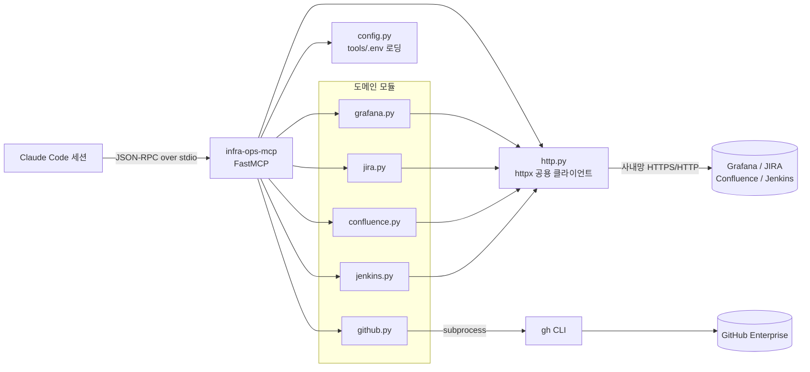
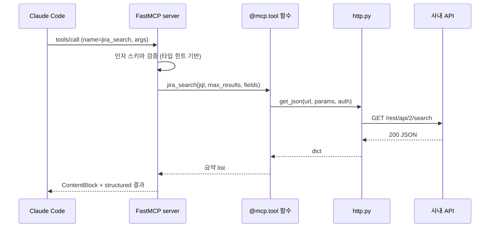
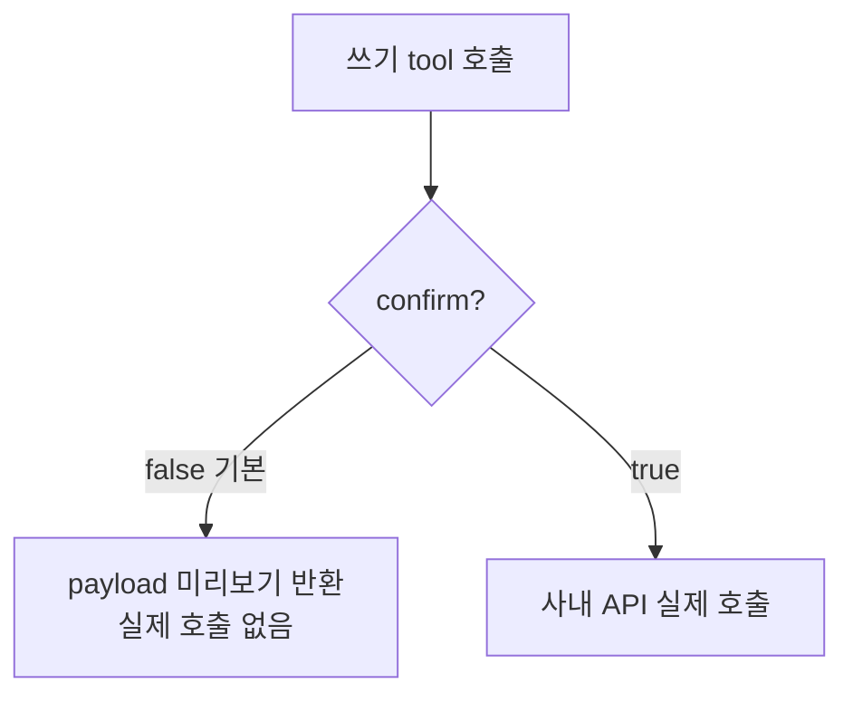

# infra-ops MCP 동작 원리

## 한 장 그림

Claude Code가 사용자 요청을 처리하다 `grafana_diagnose_alert` 같은 tool이 필요하면, stdio로 띄워 둔 이 서버에 JSON-RPC 요청을 보낸다. 서버는 해당 함수를 실행해 사내 API를 호출하고 결과를 돌려준다. 클러스터에 직접 명령하는 경로는 없다. 읽기와, 게이트를 통과한 쓰기만 한다.

## 왜 MCP 인가, 왜 stdio 인가

기존 `tools/` 스크립트는 한 번에 하나씩 Bash로 부르는 단발 명령이다. MCP로 묶으면 Claude가 대화 중에 도구 28개를 자연어로 골라 쓰고, 인자를 스키마로 검증받는다. transport는 stdio다. 로컬 프로세스를 표준입출력으로 붙이는 방식이라 별도 포트나 서버 데몬이 필요 없고, `claude mcp add` 한 줄로 등록된다.

## 요청이 흐르는 순서

서버 기동은 `server.build()` 한 곳에 모여 있다. `config.load_env()` 로 `tools/.env` 를 한 번 읽고, FastMCP 인스턴스를 만든 뒤 도메인 모듈마다 `register(mcp)` 를 불러 tool을 등록한다. 각 tool 함수의 타입 힌트가 그대로 JSON Schema가 되어 Claude 쪽 입력 검증에 쓰인다.

## 컴포넌트 책임

`config.py` 는 자격증명만 다룬다. `tools/.env` 를 읽어 도메인별로 `(url, key)` 또는 `(url, user, pass)` 튜플을 돌려준다. Grafana는 `env="prod"|"dev"` 에 따라 PROD, DEV 자격을 나눠 준다. 값이 비면 그 자리에서 에러를 낸다.

`http.py` 는 httpx 클라이언트 하나를 모듈 전역으로 재사용한다. retry 2회, 타임아웃 20초, 4xx/5xx면 `HttpError` 를 던진다. 에러 메시지에는 status만 담고 응답 본문은 속성으로만 보관한다. 토큰이 응답에 섞여 나와도 로그나 반환값에 새지 않게 하기 위해서다.

도메인 모듈 다섯 개는 같은 모양이다. 순수 로직(쿼리, payload, 마크업 빌드)은 `register` 밖 모듈 함수로 빼서 사내망 없이 단위 테스트한다. tool 자체는 `register(mcp)` 안에서 `@mcp.tool()` 로 등록한다.

`github.py` 만 예외로 httpx 대신 `gh` CLI를 subprocess로 부른다. GHE 인증을 gh가 keyring으로 관리하고 있어 그대로 얹는 쪽이 안전하다. `GH_HOST=github.smilegate.net` 를 환경에 주입한다.

## 인증 모델

| 도메인 | 방식 | 출처 |
|--------|------|------|
| Grafana | Bearer 헤더 | `GRAFANA_API_KEY` / `GRAFANA_DEV_API_KEY` |
| JIRA | Basic auth | `JIRA_USER` / `JIRA_PASS` |
| Confluence | Bearer 헤더 | `WIKI_TOKEN` |
| Jenkins | Basic auth + CSRF crumb | `JENKINS_USER` / `JENKINS_TOKEN` |
| GHE | gh CLI keyring | `gh auth` |

Grafana는 datasource proxy를 거친다. `/api/datasources/proxy/uid/{uid}/...` 경로로 Mimir(uid `prometheus`), Loki(`loki`), Tempo(`tempo`), AlertManager에 PromQL/LogQL/TraceQL/silence를 보낸다.

## 쓰기 안전 장치

생성, 수정, 삭제, 트리거, 코멘트, 전이, silence 도구는 모두 `confirm: bool = False` 를 받는다. 기본값이면 실제로 호출하지 않고 보낼 내용(`{"dry_run": true, "payload": ...}`)만 돌려준다. Claude가 무엇을 바꾸려는지 먼저 보여주고, 사람이나 호출자가 `confirm=true` 로 다시 부를 때만 실행된다.

입력 검증도 둔다. PromQL 라벨값과 메트릭 패턴은 따옴표, 백슬래시를 막아 쿼리 문자열 탈출을 차단한다. GHE는 repo 형식을 정규식으로 검증하고, 검색어는 `--` 뒤에 놓아 gh 플래그로 해석되지 않게 한다.

## TLS 처리

httpx는 `Client(transport=...)` 를 명시하면 Client의 `verify` 인자를 무시한다. 그래서 SSL 설정은 transport에 직접 준다. 사내 wiki(Confluence)는 구형 TLS renegotiation을 요구해서 OpenSSL 3.x가 기본 차단하는데, `ssl.OP_LEGACY_SERVER_CONNECT` 옵션만 허용해 통과시킨다. 인증서 검증 자체는 끄지 않는다. 검증을 한시적으로 꺼야 하면 `INFRA_OPS_INSECURE=1` 로 우회할 수 있고, 그 경우 stderr에 경고를 남긴다.

## 새 도메인이나 tool 추가하기

1. `src/infra_ops_mcp/<도메인>.py` 를 만들고 `def register(mcp): ...` 안에 `@mcp.tool()` 함수를 둔다.
2. 자격이 필요하면 `config.py` 에 헬퍼를 추가하고 `tools/.env` 키를 정한다.
3. 순수 로직은 모듈 함수로 빼서 `tests/` 에 단위 테스트를 더한다.
4. `server.py` 의 `build()` 에서 `<도메인>.register(mcp)` 를 호출한다.
5. 쓰기 도구라면 `confirm` 게이트를 반드시 넣는다.

## 검증 상태

단위 테스트 41개 통과(`pytest`). 28개 tool 전부 FastMCP `call_tool` 경로로 실행 확인했다. 읽기 도구는 실제 사내망 호출로, 쓰기 도구는 dry-run으로 확인했다.
